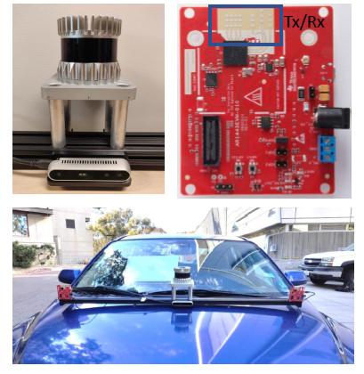

# Pointillism: A Multi-modal dataset for automotive radar sensing.
Official multi-radar Dataset release for [Pointillism: Accurate 3D Bounding Box Estimation with Multi-Radars](https://wcsng.ucsd.edu/pointillism/). Official code for the paper is available at [RP-net](https://github.com/Kshitizbansal/pointillism_rp_net).

## Sensor setup

* 1 x 16-channel OS1 Ouster LiDAR
* 1 x RealSense D415 Camera (for RGB only)
* 2 x IWR1443BOOST 3T4R Radars

## Dataset
About `300` frames are provided from each sensor for `48` different scenes. Each frame is time synchronized among all the sensors using system timestamps.

## Data Visualizer SDK
### Requirements for Visualizer
1) Download the dataset from https://drive.google.com/file/d/1C-Ryh5W5FLPenNgPUDNcNwiac-NnwU1A/view?usp=sharing in data folder.
2) Dataset in **pointillism-multi-radar-data** should follow this directory structure. 
    ```
    pointillism-multi-radar-data
    └───data
        └───scene{#}       'Where {} is omitted and # is the folder number'
            └───lidar
                └───*.pcd
            └───radar_0
                └───*.csv
            └───radar_1
                └───*.csv
            └───images
                └───*.jpg
            └───label
                └───*.json
    ```       
3) Download **ffmpeg** https://ffmpeg.org/download.html and add ffmpeg.exe to path environment variable (only required to create video).
4) Download **open3d**, http://www.open3d.org/download/, for 3D visualization.
  
### To run Visualizer:
```
To see all options type 
  python visualization.py -h

usage: visualization.py [-h] 
                        --type  [{Lidar3D,LidarBird,Camera,Radar3D,RadarBird}]
                        [--radar [RADAR [RADAR ...]]] 
                        [--video] 
                        --frame [FRAME [FRAME ...]] 
                        --dataset [DATASET [DATASET ...]]

Enter which file and type of image to be converted

optional arguments:
  -h, --help            show this help message and exit
  --type [{Lidar3D,LidarBird,Camera,Radar3D,RadarBird}]
                        --type LidarBird/Lidar3D/Camera/Radar3D/RadarBird
  --radar [RADAR [RADAR ...]]
                        --radar 1/0
  --video               Will create video of flag raised
  --frame [FRAME [FRAME ...]]
                        --frame int int
  --dataset [DATASET [DATASET ...]]
                        --dataset int
```
### Example
```
python visualization.py --type LidarBird --frame 15 90 --dataset 16 --video
```
<!-- Note: For viewing 3D pointclouds, you must first run without video and copy the view parameters to a .txt file 
   (learn more at http://www.open3d.org/docs/release/tutorial/visualization/visualization.html)
   and fill in to change the values the script file ./process.py located at line 166.
 -->
## Citation 

```
@inproceedings{bansal2020pointillism,
  title={Pointillism: accurate 3D bounding box estimation with multi-radars},
  author={Bansal, Kshitiz and Rungta, Keshav and Zhu, Siyuan and Bharadia, Dinesh},
  booktitle={Proceedings of the 18th Conference on Embedded Networked Sensor Systems},
  pages={340--353},
  year={2020}
}
```
